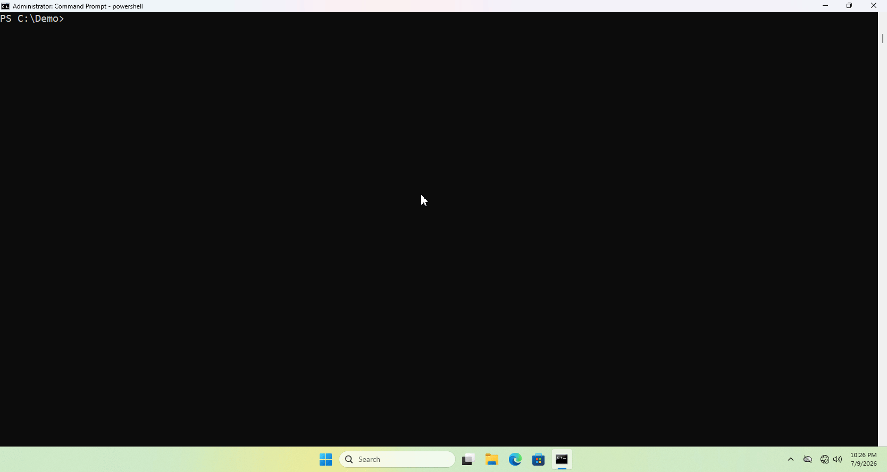

# Kattos

Loops through running processes looking for SYSTEM one. When it finds one, it duplicates the token and tries to spawn a shell. If the spawn fails, it moves to the next SYSTEM process and tries again.

This is a learning project. I built it to learn C. Didn't invent anything here.

## Warning

**This is for authorized security testing only. If you use this without permission, that's on you and it's probably illegal. Make sure you have authorization before running this anywhere.**

---

## Demo



---

## How It Works

- Enable SeDebug to open handles on other processes
- Loop through running processes hunting for SYSTEM
- Steal its token (duplicate it)
- Spin up a new process with that token
- If you're running a command (-c), pipe the output back so you see what happened
- If the spawn fails, move to the next SYSTEM process and try again

---

### Compile Command

```bash
x86_64-w64-mingw32-gcc src/Kattos.c -o Kattos.exe -static -ladvapi32 -lpsapi -municode
```

### Visual Studio

- Configuration: Release
- Platform: x64
- Runtime: /MT

---

## How to Use

```
 _._     _,-'""`-._
(,-.`._,'(       |\`-/|
    `-.-' \ )-`( , o o)
          `-    \`_`"'- S-1-5-18

Usage:
  Kattos.exe <CMD|PSH> -spawn
  Kattos.exe <CMD|PSH> -c "<command>"

Arguments:
  CMD        Launch cmd.exe
  PSH        Launch powershell.exe

Options:
  -spawn     Interactive shell.
  -c         Run a command and grab the output.

Examples:
  Kattos.exe cmd -spawn
  Kattos.exe psh -c "Get-Process"
```

---

## References

- [RastaMouse - Token Impersonation in C#](https://rastamouse.me/token-impersonation-in-csharp/)
- [MITRE ATT&CK - T1134.001](https://attack.mitre.org/techniques/T1134/001/)
- -[ASCII](https://www.asciiart.eu/art/8e03bfe9f5b3c218)
